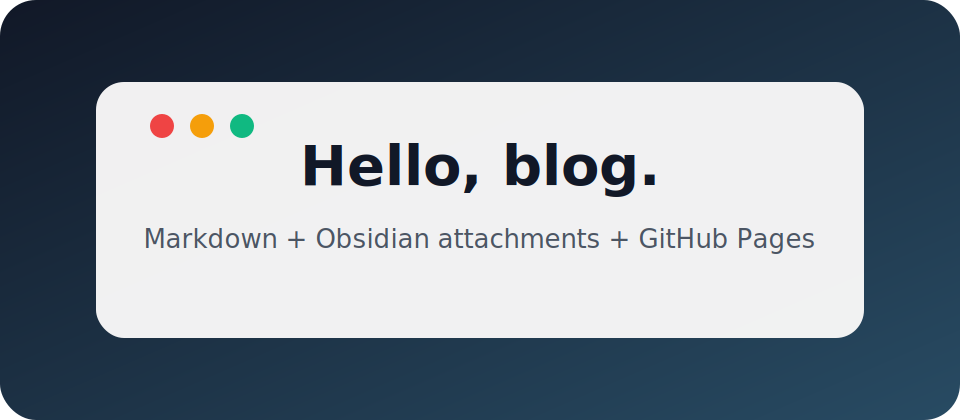

# Hello World

This is the first post, written as plain Markdown from Obsidian.

Here is a local attachment published with the post:



A few Obsidian/Quartz-friendly things work out of the box:

- Wikilink back home: [[index|Home]]
- Tags from frontmatter
- Callouts:

> [!note]
> This note can be edited directly in Obsidian and shipped via GitHub Pages.

Publishing flow:

```text
write in Obsidian → git commit/push → GitHub Actions → GitHub Pages
```
