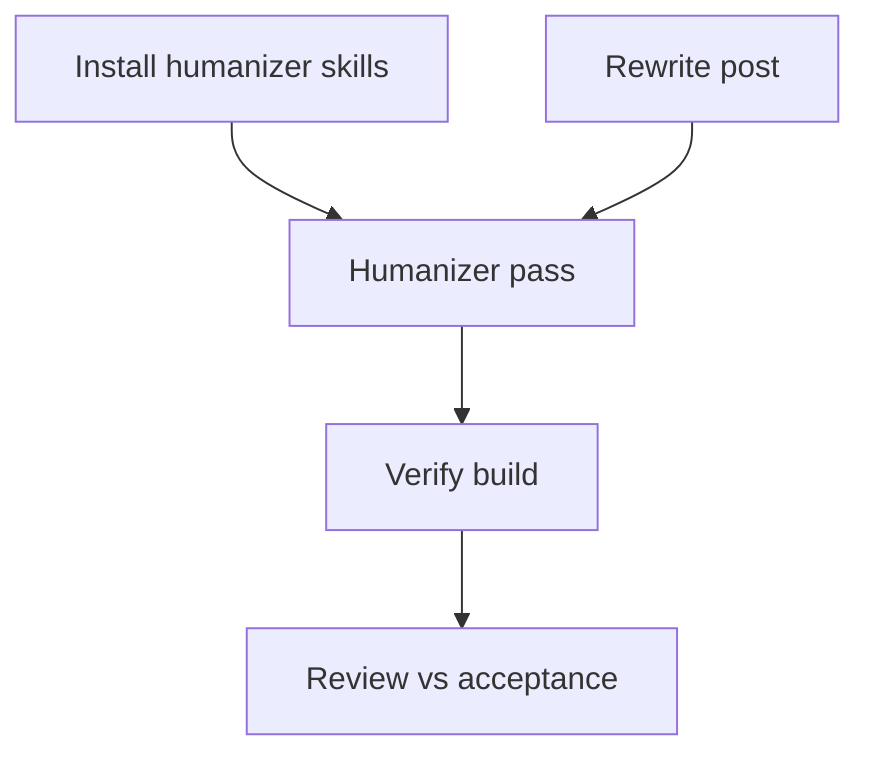

# Tasks: Humanize + refocus the pomodoro post

**Goal**: Install the humanizer skill pair (EN+ZH), then rewrite the pomodoro post around the loop-discipline thesis with the verified sync-race war story, and pass the blog verification chain.
**Spec Folder**: /Users/ted/workspace/blog/specs/20260705-1824-humanize-pomodoro-post
**Acceptance**: this file (below)

## Acceptance

Code-free spec (prose + skill install) — no planner-authored test files, no Test-paths.

### VAL-SKILL-001: Humanizer skill pair installed

Given the agent-system skill tree.
When `blader/humanizer` and `op7418/Humanizer-zh` are installed per the `skill-manager` skill (including `make sync`).
Then both skills are discoverable in a fresh session's available-skills list.
Evidence: skill list output / synced skill dirs.

### VAL-POST-001: Thesis is loop discipline, positioned for employers

Given the rewritten post.
Then its central claim is the plan/exec/verify loop discipline (locked acceptance criteria, append-only log, evidence over self-report) — not "shipped without learning JS" — and it reads as an AI-native engineering portfolio piece that promotes the Conductor skill with a link.
Evidence: read of the final post.

### VAL-POST-002: Real war story, factually accurate

Given the rewritten post.
Then it tells the sync-race story matching pomotodo commit `2f2220e`: periodic 15s sync racing the post-create sync, stale response clobbering `state.dashboard`, new task vanishing; fixed with a generation token; regression e2e landed with the fix. The take: cross-examining with a different model lineage (Codex second read) is the practice that surfaces this class of bug. No invented details.
Evidence: post text vs `git -C /Users/ted/workspace/pomotodo show 2f2220e`.

### VAL-POST-003: Humility counterweight kept, overclaim removed

Given the rewritten post.
Then the closing keeps Ted's point that AI-management skill does not replace years of engineering taste, and the current line "That is the actual skill now" is tempered accordingly. No self-defeating framing ("it's a small thing and I won't pretend otherwise" softened or cut), but no puffery either.
Evidence: read of the final post.

### VAL-POST-004: Humanizer pass applied

Given the installed `blader/humanizer` skill (post is English).
When its patterns are applied to the rewritten draft.
Then no flagged AI-tell patterns remain that the skill's checklist catches, and meaning/facts are unchanged.
Evidence: humanizer pass notes in runs/T3/.

### VAL-POST-005: Blog repo rules respected

Given `AGENTS.md` in the blog repo.
Then career wording uses approved terms (AI engineer / agentic workflows; never "full-stack developer" as self-description), the filename stays `202606181714-vibe-coding-pomodoro-full-ai-slop-stack.md`, frontmatter keeps `draft: false`, and all `![[...]]` image embeds survive.
Evidence: diff review + grep.

### VAL-BUILD-001: Site verification passes

When `npm run check` and the Node-22 Quartz build run.
Then both exit 0.
Evidence: command output in runs/T4/.

## Tasks

Planned-at: c865d0c
Execution: dag

```text
tasks[5]{id,title,depends_on,status,size,type,file,contract_refs,acceptance,write_set,tier,run_path,result}:
  T1,Install humanizer skill pair,,done,M,impl,~/.pi/agent/skills/,VAL-SKILL-001,skill list shows both skills,skills tree,standard,runs/T1/,both skills installed + synced; verified in pi skill view
  T2,Rewrite post around loop-discipline thesis,,done,L,impl,content/posts/202606181714-vibe-coding-pomodoro-full-ai-slop-stack.md,"VAL-POST-001,VAL-POST-002,VAL-POST-003,VAL-POST-005",manual read vs acceptance,content/posts/202606181714-vibe-coding-pomodoro-full-ai-slop-stack.md,deep,runs/T2/,rewritten in place; facts verified vs 2f2220e; scope clean
  T3,Humanizer pass on rewritten post,"T1,T2",done,M,impl,content/posts/202606181714-vibe-coding-pomodoro-full-ai-slop-stack.md,VAL-POST-004,humanizer checklist clean,content/posts/202606181714-vibe-coding-pomodoro-full-ai-slop-stack.md,deep,runs/T3/,33-category audit; 1 tell fixed (tailing negation); rest clean
  T4,Run blog verification chain,T3,done,S,test,package.json,VAL-BUILD-001,npm run check && quartz build,,cheap,runs/T4/,check exit 0 + quartz build exit 0 (after brew reinstall node@22 fixed stale dylib links)
  T5,Fresh-eyes review vs acceptance,T4,done,M,review,content/posts/202606181714-vibe-coding-pomodoro-full-ai-slop-stack.md,"VAL-POST-001,VAL-POST-002,VAL-POST-003,VAL-POST-004,VAL-POST-005",review vs ## Acceptance,,review,runs/T5/,all 5 VAL PASS; one caveat (Codex-surfaced claim) softened post-review; check+build re-run clean
```

### T1: Install humanizer skill pair

Follow the `skill-manager` skill (`/Users/ted/.pi/agent/skills/agent-system/skill-manager/SKILL.md`) to install two OSS skills: `https://github.com/blader/humanizer` (English) and `https://github.com/op7418/Humanizer-zh` (Chinese). Review each SKILL.md before install per skill-manager's OSS-install flow, run `make sync`, and confirm both appear in skill discovery. Deliverable: both skills usable by name.
Contract refs: VAL-SKILL-001

### T2: Rewrite post around loop-discipline thesis

Rewrite `content/posts/202606181714-vibe-coding-pomodoro-full-ai-slop-stack.md` in place. All grounding is in `CONTEXT.md` (this spec folder) — read `## Discoveries` first. Required moves:

1. **Reframe the opening.** Current hook is "shipped full-stack without learning JS" — in 2026 that's table stakes. New thesis: what made a 40-spec-folder build survivable was loop discipline — plan/exec/verify with acceptance criteria written before code, an append-only execution log, and never trusting an agent's self-report. Keep the app intro short; it's the vehicle, not the point.
2. **Add the war story as a new section** (place after the Conductor section). Facts from CONTEXT.md ## Discoveries (commit `2f2220e`, spec `20260617-2004-syncnow-resilience`): the vanishing-task race, the generation-token fix, the regression e2e landing with the fix, and the broadened verify catching two pre-existing test bugs (144/144 final). Take: a second model lineage (Codex read) cross-examining Claude's work is what surfaces state-management bugs like this — disagreement between lineages is a bug detector. Do not invent dialogue or details not in the commit/spec.
3. **Keep** the Conductor and Cmux sections' substance (spec folder anatomy, screenshots, links) but tighten; they now serve the thesis instead of being the thesis.
4. **Temper the close.** Replace "That is the actual skill now" with Ted's own counterweight: orchestration skill is real and employable, but it doesn't replace years of engineering taste — the loop is what lets someone still building that taste ship safely. Cut self-deprecation like "It's a small thing and I won't pretend otherwise" or fold it into confidence.
5. **Respect blog AGENTS.md**: approved career wording, same filename, `draft: false`, all `![[...]]` embeds preserved.

Write a summary of changes to runs/T2/summary.txt. Do NOT restructure frontmatter beyond title/description if the reframe needs it.
Contract refs: VAL-POST-001, VAL-POST-002, VAL-POST-003, VAL-POST-005

### T3: Humanizer pass on rewritten post

Load the installed `blader/humanizer` skill and run its full workflow over the rewritten post (English). Fix flagged patterns without changing facts, links, embeds, or frontmatter. Record which patterns were found/fixed in runs/T3/summary.txt.
Contract refs: VAL-POST-004

### T4: Run blog verification chain

From /Users/ted/workspace/blog: `npm run check`, then `PATH=/opt/homebrew/opt/node@22/bin:$PATH npm_config_cache=/private/tmp/blog-npm-cache npx quartz build`. Both must exit 0. Capture output to runs/T4/.
Contract refs: VAL-BUILD-001

### T5: Fresh-eyes review vs acceptance

Fresh-context reviewer reads the final post against every VAL-\* in `## Acceptance` above, checks the war story against `git -C /Users/ted/workspace/pomotodo show 2f2220e`, greps for banned wording ("full-stack developer" as self-description), and confirms embeds/filename/draft flag. Verdict per VAL id to runs/T5/review.log.
Contract refs: VAL-POST-001, VAL-POST-002, VAL-POST-003, VAL-POST-004, VAL-POST-005

## Dependency View

```text
Requires:
  T1:
  T2:
  T3: T1 T2
  T4: T3
  T5: T4

Batches:
  1: T1 T2
  2: T3
  3: T4
  4: T5
```


